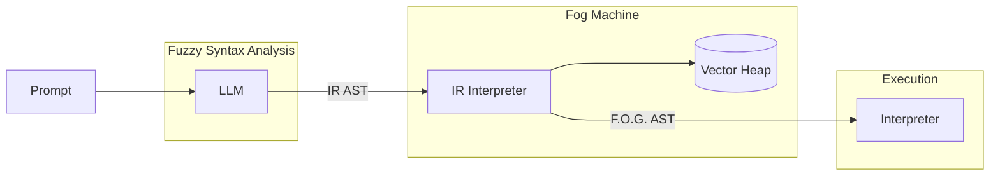

# FOG 
```
  ░▒▓██████████████████████████▓▒░         
 ░▒▓█▀▀░█░█░▀▀█░▀▀█░█░█░▒▓██▓▒░░░                        
 ░▒▓█▀▀░█░█░▄▀░░▄▀░░░█░░▒▓██▓▒░░░                        
 ░▒▓▀░░░▀▀▀░▀▀▀░▀▀▀░░▀░░▒▓██▓▒░░░                        
  ░▒▓██████████████████████████▓▒░         
 ░▒▓█▀█░█▀█░█▀▀░█▀▄░█▀█░▀█▀░▀█▀░█▀█░█▀█░█▀█░█▓▒▒▒░
 ░▒▓█░█░█▀▀░█▀▀░█▀▄░█▀█░░█░░░█░░█░█░█░█░█▀█░█▓▒▒▒░
 ░▒▓▀▀▀░▀░░░▀▀▀░▀░▀░▀░▀░░▀░░▀▀▀░▀▀▀░▀░▀░▀░▀░▀▀▀▓▒░
  ░▒▓██████████████████████████▓▒░         
 ░▒▓█▀▀░█▀▄░█▀█░█▄█░█▄█░█▀█░█▀▄░▒▓██▓▒░                 
 ░▒▓█░█░█▀▄░█▀█░█░█░█░█░█▀█░█▀▄░▒▓██▓▒░                 
 ░▒▓▀▀▀░▀░▀░▀░▀░▀░▀░▀░▀░▀░▀░▀░▀░▒▓██▓▒░                 
  ░▒▓██████████████████████████▓▒░
```

## Description
F.O.G. (Fuzzy Operational Grammar) is a functional language and VM purpose-built to extend and empower AI models through programmatic and composable function/tool calling. At its core lies the _Fog Machine_, an interpreter and runtime that enables LLMs to generate, plan, and execute instructions using a simple functional intermediate representation (IR).

By serving as the computation and action layer for LLM agents, FOG makes it possible to build complex, dynamic, and extensible workflows, letting AI models not only "think" but also "do" within well-defined, controlled boundaries.

## Architecture



## Getting started 

```sh
# Fill in the configuration from template
$ cp .env.template .env.local

# Start services in a separate terminal
$ docker compose up

# Install the binary
$ go install

# Migrate up
$ fog migrate postgres up

# Seed the DB
$ fog seed

# Run the fog REPL 
$ fog

# Help
$ fog -h

# Run example
$ fog -d


         ░░▒▒▓▓██▓▓▒▒░
        ░▒▓█████████▓▒░
        ▒▓▓▓ F O G ▓▓▓▒
        ░▒▓█████████▓▒░
         ░░▒▒▓▓██▓▓▒▒░


>  get weather in my current city

╔════════════════════════════════════════════════════════════╗
║         Parsing prompt into the Intermediate AST...        ║
╚════════════════════════════════════════════════════════════╝

{
  "type": "FunctionCall",
  "description": "get the weather in a given city",
  "children": [
    {
      "type": "FunctionCall",
      "description": "get the location coordinates for the current city"
    }
  ]
}

╔════════════════════════════════════════════════════════════╗
║         Compiling Intermediate AST into FOG AST...         ║
╚════════════════════════════════════════════════════════════╝

{
  "type": "FunctionCall",
  "name": "getWeather",
  "description": "get the weather in a given city",
  "js": "function getWeather(city) { return { city: city, temp: 70, condition: \"sunny\" }; }",
  "distance": 0.05404893369210706,
  "children": [
    {
      "type": "FunctionCall",
      "name": "__getCurrentCity__",
      "description": "get the location coordinates for the current city",
      "js": "function __getCurrentCity__() { return \"Tokyo\"; }",
      "distance": 0.18011193097638434
    }
  ]
}

╔════════════════════════════════════════════════════════════╗
║           Evaluating the Intermediate AST...               ║
╚════════════════════════════════════════════════════════════╝

Result: map[city:Tokyo condition:sunny temp:70]
```

## Add functions

Add your predefined JS functions to the [seed_data.json](./internal/db/postgres/seed/seed_data.json) file.


## TODOs
- [ ] Autogenerate code when function is missing or distance is too low
- [ ] Integrate the MCP into function calling
- [ ] Cache high-confidence AST evaluations 
- [ ] Create builtin primitives for security and private function calls
- [ ] Add tests